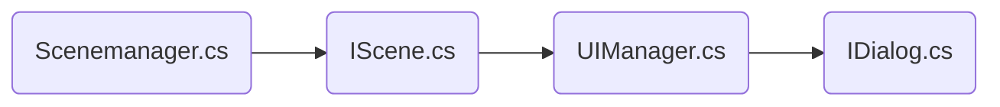

# Project Framework and Portpolio
- 해당 프로젝트는 unityProject입니다.
- 프로젝트를 열어 각 프레임워크에 해당하는 씬을 열어 실행해볼 수 있습니다.
## Index

1. [Pattern](#pattern)
2. [적용된패턴](#적용된패턴들)
    - [옵저버패턴](#observerpattern)
    - [MVC패턴](#mvcpattern)
    - [FSM패턴](#fsmpattern)
3. [플레이팹(인벤토리 예시)](#플레이팹관리)

## Pattern

### 소개 
- 주로 사용하거나 프로젝트 사용시 필수로 사용되는 패턴

### 목적
- 유니티 이용한 게임 개발시 생산성을 높이고 유지 보수를 용이하게 하기 위함.

### 전략
- `다른 프로젝트들에서 개발한 기능들을 공용으로 사용`
    - 한번 구성한 뒤 재사용함으로서 편의 제공
    - 계속적인 리뷰를 통해 코드 리팩토링을 하고 더 수준높은 디자인 패턴 구현

- `ECS에 따른 객체지향적인 시스템을 만들것.`
    - 기존엔 `MVC`에 따른 코드를 지향했으나 `Unity`는 Entity(Gameobject)에 Component가 종속되어 있는 관계로
    MVC패턴을 적용하기가 까다롭다. 즉, 시스템의 속도 측면에서 ECS를 지향하는 방식으로 코드작업을 실행한다.
    (이것은 패턴뿐 아니라 일반적은 코드작업에서도 적용)

### 활용
- 디자인 패턴은 컴포넌트처럼 되도록 어디에 쓰든 활용 가능하게.
- 복잡할순 있어도 적용이 좋게(느슨한 결합)

## 적용된패턴들

### Observerpattern
- 특정 클래스 등의 정보를 전달하기 위해 직접 간섭이 아니라 정보를 전달함으로써 클래스 간의 심한 간섭을 없앤다.
- 전달받기위해 등록된 함수들을 관리한다.

```mermaid
graph LR
A((A클래스)AddMessage)-->B(Message.cs)
C((B클래스)AddMessage)-->B
D((C클래스)SendMessage)-.->B
B-.->C
B-.->A
```
<details>
<summary>
    <span style="color:#008000">옵저버패턴 코드 내용 보기</span>
</summary>
    <div markdown="1">

- Message.cs
```code
private static Dictionary<string, List<Delegate>> handlers = new Dictionary<string, List<Delegate>>();

    private static void RegisterListener(string messageName, Delegate callback)
    {
        if (callback == null)
            return;
        if(!handlers.ContainsKey(messageName))
        {
            handlers.Add(messageName, new List<Delegate>());
        }
        List<Delegate> messagelst = handlers[messageName];
        Delegate ms = messagelst.Find(o => o.Method == callback.Method && o.Target == callback.Target);
        if(ms!=null)
        {
            throw new ArgumentException("Callback method is already exist!!", messageName);
        }
        messagelst.Add(callback);
    }
    private static void UnRegisterListener(string messageName, Delegate callback)
    {
        if (callback == null)
            return;
        if (!handlers.ContainsKey(messageName))
            return;

        List<Delegate> messagelst = handlers[messageName];
        Delegate ms = messagelst.Find(o => o.Method == callback.Method && o.Target == callback.Target);
        if (ms == null)
            return;
        messagelst.Remove(ms);
    }

    private static void SendMessage<T>(string messageName,T e) where T:Message
    {
        if (!handlers.ContainsKey(messageName))
            return;

        List<Delegate> messagelst = handlers[messageName];

        for(int i=0; i<messagelst.Count; i++)
        {
            if (messagelst[i].GetType() != typeof(Action<T>))
                continue;

            var _event=(Action<T>)messagelst[i];
            _event(e);
        }
    }
```
</div>
</details>

### MVCPattern
- ECS지향적으로 바꾸기 전 최대한 Model,Control,View 로 나누어 최대한 객체지향적인 코드를 짜고자 했다.
- 그러나 현재 Entity와 Component의 종속성을 그대로 두고 System쪽을 최대한 객체지향적인 코드로 바꾸기 있기 떄문에
이 패턴은 최대한 간소화 하였다
- 현재는 Scene과 Dialog(UI)를 관리하도록 하고 프리팹으로 생성하여 작업을 하고 있다
- IScene과 IDialog로 부모클래스로 만들어 View와 Model만 따로 관리하도록 만들었다.

| 스크립트명            | 역할 및 내용                                                            |
| ----------------- | ----------------------------------------------------------------------- |
| Scenemanager.cs | 씬프리팹,씬과 모델 데이터 관리 |
| IScene.cs   | 해당 씬의 모델데이터, 씬 내용 포함|
| UIManager.cs | Dialog(UI)의 내용 관리|
| IDialog.cs| 자신이 보여주는 UI의 내용 포함|



<details>
<summary> <span style="color:#008000">MVC패턴 코드 내용 보기</span></summary>
    <div markdown="1">
        
- Scenemanager.cs
```Code
    public class SceneManager : Monosingleton<SceneManager>
    {
        ...
        public void LoadStartScene()
        {
            ...
            if (scene == null)
            {
                var fullpath = string.Format("Scenes/{0}", sceneName);
                StartCoroutine(ResourcesLoader.Instance.Load<GameObject>(fullpath, o => OnPostLoadProcess(o)));
            }
        }
        void OnPostLoadProcess(Object o)
        {
            var scene = Instantiate(o) as GameObject;

            var sceneScript = scene.GetComponent<IScene>();
            ...
            SetupScene(sceneScript);
        }
        void SetupScene(IScene scene)
        {
            var scenescript = scene.GetComponent<IScene>();
            scenescript.LoadAssets(
                () =>
                {
                    AllSceneLoaded = true;
                });
        }
    }
```

- Iscene.cs
```code
        public class IScene : MonoBehaviour
        {
            ...
            public void LoadAssets(Action onComplete)
            {
                _onLoadComplete = onComplete;
                StartCoroutine(LoadContents());
            }

            IEnumerator LoadContents()
            {
                ...
                for (int i = 0; i < UIList.Count; ++i)
                {
                    yield return StartCoroutine(UIManager.Instance.Load(UIList[i],
                        c =>
                        {
                            _loadingContentsCount--;
                            OnContentLoadComplete(c); 
                        }));
                }
                ...
            }
            void EnterContents()
            {
                for (int i = 0; i < EnterUIList.Count; i++)
                {
                    Message.Send<ShowDialogMsg>(new ShowDialogMsg(), EnterUIList[i]);
                }
            }
        }
```
- UIManager.cs
```code
public class UIManager : Monosingleton<UIManager>
{
   ...
    public IEnumerator Load(string uiName,OnComplete oncomplete)
    {
       ...
        if(ui==null)
        {
            var path = string.Format("{0}/{1}", ASSET_PATH, uiName);
            yield return StartCoroutine(ResourcesLoader.Instance.Load<GameObject>(path,o=> OnPostLoadProcess(o)));
        }
       ...
    }
}

```
- IDialog.cs
```code
public class IDialog : MonoBehaviour
{
  ...
    public void Load()
    {
        typeName= GetType().Name;
        rt= GetComponent<RectTransform>();

        Message.AddMessage<ShowDialogMsg>(Enter,typeName);
        Message.AddMessage<HideDialogMsg>(Exit, typeName);

        OnLoad();
        DialogView.SetActive(false);
    }
    public void Unload()
    {
        Message.RemoveMessage<ShowDialogMsg>(Enter, typeName);
        Message.RemoveMessage<HideDialogMsg>(Exit, typeName);

        OnExit();
        OnUnload();
    }
...
    public static void RequestDialogEnter<T>() where T : IDialog
    {
        Message.Send<ShowDialogMsg>(new ShowDialogMsg(),typeof(T).Name);
    }

    public static void RequestDialogExit<T>() where T : IDialog
    {
        Message.Send<HideDialogMsg>(new HideDialogMsg(), typeof(T).Name);
    }
}

```  
</div>
</details>

### FSMPattern
- 캐릭터 및 씬 등의 상태관리를 위해 유한상태기계 패턴을 활용
- 캐릭터는 idle,attack,walk,run 등 상태관리를 위해 코드 관리, 최적화 관리를 

<details>
<summary> <span style="color:#008000">FSM패턴 코드 내용 보기 </span></summary>
    <div markdown="1">

```Code

```
</div>
</details>

## 플레이팹관리
- azure에서 제공하는 playfab을 사용하여 DB등 유저 데이터를 관리합니다
- 서버관련 내용을 사용합니다(랭킹,우편,인벤토리 관리 등)
